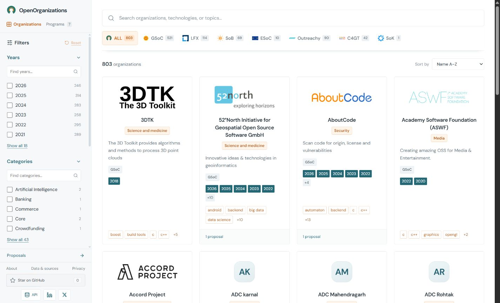

  

  
Find a community. Explore its history. Make your first contribution.

  

    
    &nbsp;
    
  

  

    
    
    
  

   

  

  
Search communities by technology · Compare program history · Learn from public proposals

   

  

    
    &nbsp;&nbsp;
    
    &nbsp;&nbsp;
    
    &nbsp;&nbsp;
    
    &nbsp;&nbsp;
    
    &nbsp;&nbsp;
    
    &nbsp;&nbsp;
    
  

  
GSoC · LFX · Summer of Bitcoin · ESoC · Outreachy · C4GT · Season of KDE

  
<a href="https://openorganizations.site/programs/">All programs</a> &nbsp;·&nbsp; <a href="https://openorganizations.site/sources/">Sources &amp; coverage</a>

  

  <h3>Found your next community? Star for a cookie! 🍪</h3>
  
<a href="https://github.com/satwiksps/openorganizations/stargazers">Give OpenOrganizations a star</a> and help others find their starting point.

  
Inspired by <a href="https://www.gsocorganizations.dev/">GSoC Organizations</a> · Made with ♥ by <a href="https://github.com/satwiksps">satwiksps</a>

